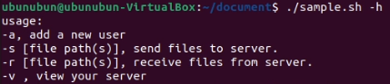
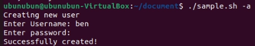
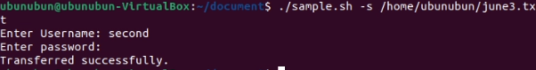
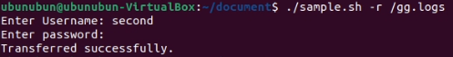
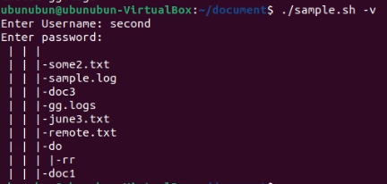

# Linux File Sharing Tool

## Overview:
The __Linux File Sharing Tool__ is a command-line utility designed to facilitate secure and efficient file sharing between local machines and a centralized server. With four distinct modes, users can seamlessly transfer files between their devices and their personal accounts on the server, making it convenient to access files from any Linux terminal.

## Key Features:

- Add User Mode `(-a)`: Users can create an account on the server using the tool's add user mode. This mode enables users to set up their personal storage space and establish secure access to their files.
- Send Mode `(-s <filepath>)`: This mode allows users to send files from their local machine to their personal account on the server. By specifying the file path, users can initiate secure file transfers with ease.

- Receive Mode `(-r <filepath>)`: Users can retrieve files from their personal account on the server to their local machine using the receive mode. By specifying the file path, users can securely download files and access them locally.

- View Files Mode `(-v)`: Users can view the files stored in their personal account on the server using the view files mode.

- Help `(-h)`: Allows users to view a help menu and review the syntax and usage of the different modes.




## Benefits:

1. __Secure File Sharing__: The Linux File Sharing Tool ensures secure file transfers between local machines and the centralized server, protecting sensitive data during transmission.

2. __Convenience__: Users can easily send files from their local machine to the server and receive files from the server to their local machine, all from the command-line interface.

3. __Centralized Storage__: By utilizing the server's storage space, users can access their files from any Linux terminal, providing flexibility and convenience.

4. __Efficient File Management__: The different modes of the tool enable users to add, send, receive, and view files, empowering them to organize and manage their files effectively.


By leveraging the _`Linux File Sharing Tool`_, users can simplify their file sharing workflows and securely access their files from any Linux terminal. The tool's intuitive modes enable seamless file transfers and efficient file management, enhancing productivity and accessibility for Linux users.

## Usage

### Cloning the Repository

You can clone the repository to your local machine by running the following command:

```bash
git clone https://github.com/Saru2003/Linux-File-Sharing-Tool.git
```
Alternatively, you can download the ZIP file and extract it.

### Installing Dependencies
Before running the tool, ensure that you have the necessary Python modules installed. You can install them by running the following command:
```bash
pip install -r requirements.txt
```
After installing the requirements, Linux users need to follow these steps:

* Navigate to the directory where the `Linux-File-Sharing-Tool` repository is located. You can use the `cd` command to change the directory. For example:
   
   ```bash
   cd path/to/Linux-File-Sharing-Tool
   ```

* Make the `lfs` file executable by running the following command with root privileges:


   ```bash
   sudo chmod +x lfs.sh
   ```

* Make the `data.py` file executable by running the following command with root privileges:

   ```bash
   sudo chmod +x data.py
   ```
   This command grants executable access to the file.

* Additionally, you can run the `lfs.sh` command from anywhere, by running the following command

    ```bash
    sudo cp lfs.sh /usr/local/bin
    ```
Now you are ready to run the `lfs.sh` script.

## Running the Tool

---
**NOTE**

In the instructions, please note that in the accompanying pictures, the script may be referred to as ./sample.sh instead of lfs.sh. This is just for illustrative purposes, and you should use lfs.sh as the actual script name when running the commands.

---

 #### 1. Adding a User:

- To add a user, run the command `lfs.sh -a` in your terminal.
- The tool will prompt you to enter a username and password. Enter the desired username and password, and remember these credentials for future access to your account.



#### 2. Sending a File:

- To send a file from your local machine to the server, use the `-s` mode.
- Run the command `lfs.sh -s <filepath>`, where `<filepath>` is the path to the file you want to send.
- Provide your username and password when prompted. The file will be transferred to your account on the server.

  


#### 3. Receiving a File:

- To retrieve a file from your server to your local machine, use the `-r` mode.
- Run the command `lfs.sh -r <filepath>`, where `<filepath>` is the path where you want to save the received file.
- Provide your username and password when prompted. The file will be downloaded from your server and saved to the location from where the command is run.

  

#### 4. Viewing Your Files:

- To view the file structure of your account on the server, use the `-v` mode.
- Run the command `lfs.sh -v` in your terminal.
- Provide your username and password when prompted.
- The tool will display the directory structure of your account on the server.

  

Please ensure that you have the necessary permissions and credentials to perform these actions.


## License

This project is licensed under the GNU General Public License. See the [LICENSE](https://github.com/Saru2003/Linux-File-Sharing-Tool/blob/main/LICENSE) file for details.
